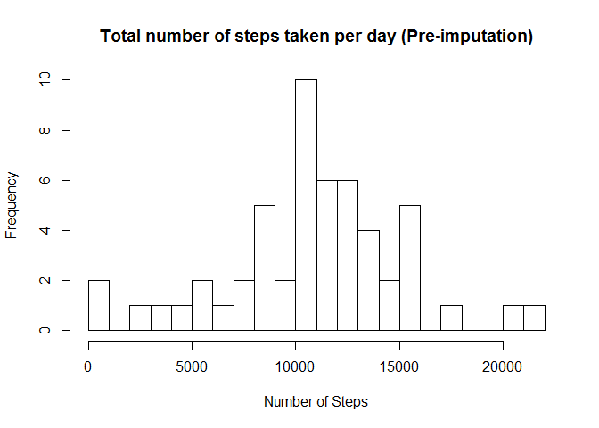

# Reproducible Research: Peer Assessment 1
##Loading and preprocessing the data
###1. Load the data *(i.e.  read.csv() )*

- First: We unzip the zip file to retrieve the .csv file.
- Then we read the data file and park it under the "activity" variable :)

```r
unzip("repdata_data_activity.zip")
activity <- read.csv("activity.csv")
```

LOADED!

##Process/transform the data into a format suitable for your analysis


###1. Make a **histogram** of the *total number of steps taken per day*

- Let's take a look at whats inside the data:

```r
str(activity)
```

```
## 'data.frame':	17568 obs. of  3 variables:
##  $ steps   : int  NA NA NA NA NA NA NA NA NA NA ...
##  $ date    : Factor w/ 61 levels "2012-10-01","2012-10-02",..: 1 1 1 1 1 1 1 1 1 1 ...
##  $ interval: int  0 5 10 15 20 25 30 35 40 45 ...
```

```r
head(activity)
```

```
##   steps       date interval
## 1    NA 2012-10-01        0
## 2    NA 2012-10-01        5
## 3    NA 2012-10-01       10
## 4    NA 2012-10-01       15
## 5    NA 2012-10-01       20
## 6    NA 2012-10-01       25
```
- Issues spotted that needed fixing:
  1. Missing data in activity$steps. Lets fix it by putting non-NAs into a new d.f:

```r
activity_rmNAsteps <- activity[which(!is.na(activity$steps)),]
str(activity_rmNAsteps)
```

```
## 'data.frame':	15264 obs. of  3 variables:
##  $ steps   : int  0 0 0 0 0 0 0 0 0 0 ...
##  $ date    : Factor w/ 61 levels "2012-10-01","2012-10-02",..: 2 2 2 2 2 2 2 2 2 2 ...
##  $ interval: int  0 5 10 15 20 25 30 35 40 45 ...
```

```r
head(activity_rmNAsteps)
```

```
##     steps       date interval
## 289     0 2012-10-02        0
## 290     0 2012-10-02        5
## 291     0 2012-10-02       10
## 292     0 2012-10-02       15
## 293     0 2012-10-02       20
## 294     0 2012-10-02       25
```
  
  2. Date class is wrong.

```r
activity_rmNAsteps$date <-as.Date(activity_rmNAsteps$date)
str(activity_rmNAsteps)
```

```
## 'data.frame':	15264 obs. of  3 variables:
##  $ steps   : int  0 0 0 0 0 0 0 0 0 0 ...
##  $ date    : Date, format: "2012-10-02" "2012-10-02" ...
##  $ interval: int  0 5 10 15 20 25 30 35 40 45 ...
```

```r
head(activity_rmNAsteps)
```

```
##     steps       date interval
## 289     0 2012-10-02        0
## 290     0 2012-10-02        5
## 291     0 2012-10-02       10
## 292     0 2012-10-02       15
## 293     0 2012-10-02       20
## 294     0 2012-10-02       25
```
  
  3. Data need to be rearraged by dates.

```r
library("dplyr")
```

```
## 
## Attaching package: 'dplyr'
```

```
## The following objects are masked from 'package:stats':
## 
##     filter, lag
```

```
## The following objects are masked from 'package:base':
## 
##     intersect, setdiff, setequal, union
```

```r
by_date <- group_by(activity_rmNAsteps, date)
summarise(by_date, sum(steps)) -> steps_per_day
```
  

```r
steps_per_day
```

```
## # A tibble: 53 × 2
##          date `sum(steps)`
##        <date>        <int>
## 1  2012-10-02          126
## 2  2012-10-03        11352
## 3  2012-10-04        12116
## 4  2012-10-05        13294
## 5  2012-10-06        15420
## 6  2012-10-07        11015
## 7  2012-10-09        12811
## 8  2012-10-10         9900
## 9  2012-10-11        10304
## 10 2012-10-12        17382
## # ... with 43 more rows
```


```r
hist(steps_per_day$`sum(steps)`,freq=TRUE, breaks=30, 
     main = "Histogram - Total number of steps taken per day", xlab="Number of Steps")
```

<!-- -->

## What is mean total number of steps taken per day?
###2. The **mean** and **median** of *total number of steps taken per day.*


```r
mean(steps_per_day$`sum(steps)`)
```

```
## [1] 10766.19
```

```r
median(steps_per_day$`sum(steps)`)
```

```
## [1] 10765
```

##What is the average daily activity pattern?

###1.Make a time series plot *(i.e.  type = "l")* of the 5-minute interval (x-axis) and the average number of steps taken, averaged across all days (y-axis)
Mean steps by intervals, averaged across all days

```r
by_interval <- group_by(activity_rmNAsteps, interval)
summarise(by_interval, mean(steps)) -> meansteps_per_interval
```
Make the time series plot (type = "l" ) of the 5-minute interval (x-axis)

```r
plot(y=meansteps_per_interval$`mean(steps)`, x=meansteps_per_interval$interval, type="l", xlab= "5_Minute_Intervals", main="Average daily activity pattern over 5-minute intervals", ylab = "Average number of steps")
```

<!-- -->

###2.Which 5-minute interval, on average across all the days in the dataset, contains the maximum number of steps?

```r
print(meansteps_per_interval$interval[meansteps_per_interval$`mean(steps)`==max(meansteps_per_interval$`mean(steps)`)])
```

```
## [1] 835
```

##Imputing missing values

###1.Calculate and report the total number of missing values in the dataset *(i.e. the total number of rows with NAs)*

```r
str(activity)
```

```
## 'data.frame':	17568 obs. of  3 variables:
##  $ steps   : int  NA NA NA NA NA NA NA NA NA NA ...
##  $ date    : Factor w/ 61 levels "2012-10-01","2012-10-02",..: 1 1 1 1 1 1 1 1 1 1 ...
##  $ interval: int  0 5 10 15 20 25 30 35 40 45 ...
```

```r
sum(is.na(activity))
```

```
## [1] 2304
```

```r
sum(is.na(activity$steps))
```

```
## [1] 2304
```

```r
sum(is.na(activity$date))
```

```
## [1] 0
```

```r
sum(is.na(activity$interval))
```

```
## [1] 0
```


###2.Devise a strategy for filling in all of the missing values in the dataset. The strategy does not need to be sophisticated. For example, you could use the mean/median for that day, or the mean for that 5-minute interval, etc.

Lets impute missing values with mean of their respective interval across the whole period. :)

```r
by_interval <- group_by(activity_rmNAsteps, interval)
summarise(by_interval, mean(steps)) -> meansteps_per_interval
incomplete <- sum(!complete.cases(activity))
activityNAimputed <- transform(activity,
                steps=ifelse(is.na(activity$steps), 
                meansteps_per_interval$`mean(steps)`[match(activity$interval, meansteps_per_interval$interval)], 
                activity$steps))
```

###3.Create a new dataset that is equal to the original dataset but with the missing data filled in.

```r
head(activityNAimputed)
```

```
##       steps       date interval
## 1 1.7169811 2012-10-01        0
## 2 0.3396226 2012-10-01        5
## 3 0.1320755 2012-10-01       10
## 4 0.1509434 2012-10-01       15
## 5 0.0754717 2012-10-01       20
## 6 2.0943396 2012-10-01       25
```

```r
sum(is.na(activityNAimputed))
```

```
## [1] 0
```

###4.4.Make a histogram of the total number of steps taken each day and Calculate and report the mean and median total number of steps taken per day. Do these values differ from the estimates from the first part of the assignment? What is the impact of imputing missing data on the estimates of the total daily number of steps?
Before imputation vs After imputation

```r
hist(steps_per_day$`sum(steps)`,freq=TRUE, breaks=30, 
     main = "Total number of steps taken per day (Pre-imputation)", xlab="Number of Steps")
```

<!-- -->

```r
by_date <- group_by(activityNAimputed, date)
summarise(by_date, sum(steps)) -> steps_per_day_imputed
hist(steps_per_day_imputed$`sum(steps)`,freq=TRUE, breaks=30, 
     main = "Total number of steps taken per day (Post-imputation)", xlab="Number of Steps")
```

<!-- -->

```r
mean(steps_per_day$`sum(steps)`)
```

```
## [1] 10766.19
```

```r
mean(steps_per_day_imputed$`sum(steps)`)
```

```
## [1] 10766.19
```

```r
median(steps_per_day$`sum(steps)`)
```

```
## [1] 10765
```

```r
median(steps_per_day_imputed$`sum(steps)`)
```

```
## [1] 10766.19
```
Imputation of data with means basically makes your data more central to the sample mean. (if you want to retain the sample mean for some reason.)

##Are there differences in activity patterns between weekdays and weekends?

###1.Create a new factor variable in the dataset with two levels -- "weekday" and "weekend" indicating whether a given date is a weekday or weekend day.

```r
activityNAimputed->activity_wkendwkday
activity_wkendwkday$date <-as.Date(activity_wkendwkday$date)
activity_wkendwkday<-mutate(activity_wkendwkday,weektype=ifelse(weekdays(activity_wkendwkday$date)=="Saturday"|weekdays(activity_wkendwkday$date)=="Sunday", "weekend", "weekday"))
str(activity_wkendwkday)
```

```
## 'data.frame':	17568 obs. of  4 variables:
##  $ steps   : num  1.717 0.3396 0.1321 0.1509 0.0755 ...
##  $ date    : Date, format: "2012-10-01" "2012-10-01" ...
##  $ interval: int  0 5 10 15 20 25 30 35 40 45 ...
##  $ weektype: chr  "weekday" "weekday" "weekday" "weekday" ...
```

```r
head(activity_wkendwkday)
```

```
##       steps       date interval weektype
## 1 1.7169811 2012-10-01        0  weekday
## 2 0.3396226 2012-10-01        5  weekday
## 3 0.1320755 2012-10-01       10  weekday
## 4 0.1509434 2012-10-01       15  weekday
## 5 0.0754717 2012-10-01       20  weekday
## 6 2.0943396 2012-10-01       25  weekday
```

```r
tail(activity_wkendwkday)
```

```
##           steps       date interval weektype
## 17563 2.6037736 2012-11-30     2330  weekday
## 17564 4.6981132 2012-11-30     2335  weekday
## 17565 3.3018868 2012-11-30     2340  weekday
## 17566 0.6415094 2012-11-30     2345  weekday
## 17567 0.2264151 2012-11-30     2350  weekday
## 17568 1.0754717 2012-11-30     2355  weekday
```
###2.Make a panel plot containing a time series plot (i.e.  type = "l" ) of the 5-minute interval (x-axis) and the average number of steps taken, averaged across all weekday days or weekend days (y-axis). The plot should look something like the following, which was created using simulated data:

```r
by_intervalwkendwkday <- group_by(activity_wkendwkday, interval,weektype)
summarise(by_intervalwkendwkday, mean(steps)) -> meansteps_per_intervalwkendwkday
str(meansteps_per_intervalwkendwkday)
```

```
## Classes 'grouped_df', 'tbl_df', 'tbl' and 'data.frame':	576 obs. of  3 variables:
##  $ interval   : int  0 0 5 5 10 10 15 15 20 20 ...
##  $ weektype   : chr  "weekday" "weekend" "weekday" "weekend" ...
##  $ mean(steps): num  2.2512 0.2146 0.4453 0.0425 0.1732 ...
##  - attr(*, "vars")=List of 1
##   ..$ : symbol interval
##  - attr(*, "drop")= logi TRUE
```

```r
head(meansteps_per_intervalwkendwkday)
```

```
## Source: local data frame [6 x 3]
## Groups: interval [3]
## 
##   interval weektype `mean(steps)`
##      <int>    <chr>         <dbl>
## 1        0  weekday    2.25115304
## 2        0  weekend    0.21462264
## 3        5  weekday    0.44528302
## 4        5  weekend    0.04245283
## 5       10  weekday    0.17316562
## 6       10  weekend    0.01650943
```

```r
meansteps_per_intervalwkendwkday$weektype<-as.factor(meansteps_per_intervalwkendwkday$weektype)
str(meansteps_per_intervalwkendwkday)
```

```
## Classes 'grouped_df', 'tbl_df', 'tbl' and 'data.frame':	576 obs. of  3 variables:
##  $ interval   : int  0 0 5 5 10 10 15 15 20 20 ...
##  $ weektype   : Factor w/ 2 levels "weekday","weekend": 1 2 1 2 1 2 1 2 1 2 ...
##  $ mean(steps): num  2.2512 0.2146 0.4453 0.0425 0.1732 ...
##  - attr(*, "vars")=List of 1
##   ..$ : symbol interval
##  - attr(*, "drop")= logi TRUE
```

```r
head(meansteps_per_intervalwkendwkday)
```

```
## Source: local data frame [6 x 3]
## Groups: interval [3]
## 
##   interval weektype `mean(steps)`
##      <int>   <fctr>         <dbl>
## 1        0  weekday    2.25115304
## 2        0  weekend    0.21462264
## 3        5  weekday    0.44528302
## 4        5  weekend    0.04245283
## 5       10  weekday    0.17316562
## 6       10  weekend    0.01650943
```

```r
library("ggplot2")
plot<-ggplot(meansteps_per_intervalwkendwkday, aes(x=interval, y=meansteps_per_intervalwkendwkday$`mean(steps)`,color= weektype)) +
  geom_line() +
  facet_wrap(~weektype, ncol = 1, nrow=2)
plot
```

<!-- -->

Seems like there is a difference in activity patterns (steps on average per interval) between weekdays and weekends.
